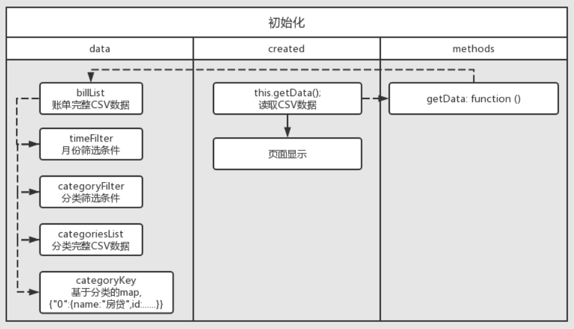

# charge-account

### 项目设置

```
npm install
```

### 项目运行

```
npm run serve
```

### 思考问题

* 如何读取CSV文件？
    * 使用`axios`异步读取文件
    * 将读取到的csv文件格式的内容通过 `d3-dsv`进行转换，生成json机构。
* 如何牵一发而动全身？
    * 触发数据更新的事件：
        * 初始化
        * 按月份搜索
        * 按分类搜索
        * 创建账单
    * 初始化流
        * 
    * 按月份搜索流

