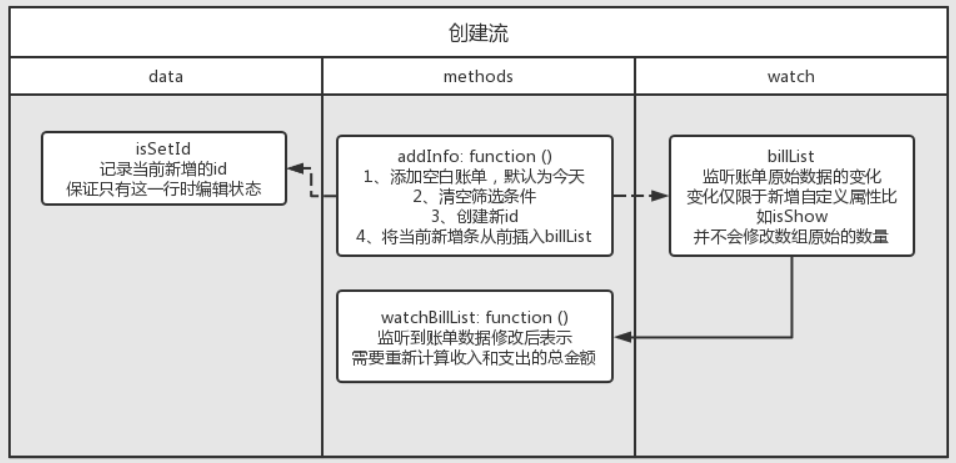

# charge-account

### 项目设置

```
npm install
```

### 项目运行

```
npm run serve
```

### 项目思路

* 如何读取CSV文件？
    * 使用`axios`异步读取文件
    * 将读取到的csv文件格式的内容通过`d3-dsv`进行转换，生成json结构。
* 如何牵一发而动全身？
    * 主要方法时监听账单数据 `billList` 的变化
    * 触发`billList`账单数据更新的事件：
        * 初始化
        * 按时间/分类搜索
        * 创建账单
    * 初始化流
        * 读取CSV文件的数据并生成json结构。
        * 相应变量添加属性，页面展示。
        * 
    * 按时间/分类筛选流
        * 根据时间/分类进行筛选时，只对原始的账单数据新增自定义属性`isShow`，并不会修改源数据。
        * 最后不符合条件的数据不展示由过滤器`billShow`进行处理。
        * 同时账单原始数据 `billList` 被修改时触发监听器。
        * 重新统计和计算支出/收入的最新结果，展示在右侧
        * 
    * 创建账单流
        * 按原有的数据结构创建空白的数据。
        * 将选择和输入的数据绑定到 `addBillInfo`对象中。
        * 


